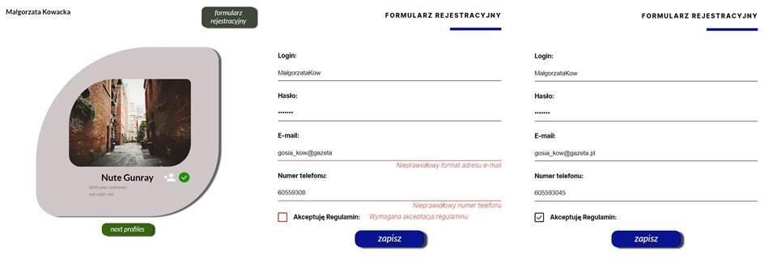
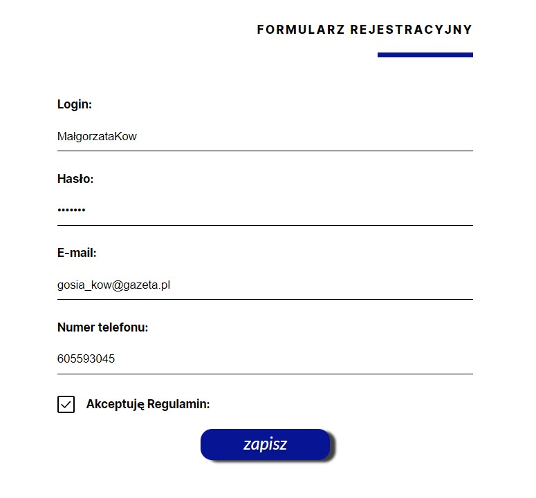
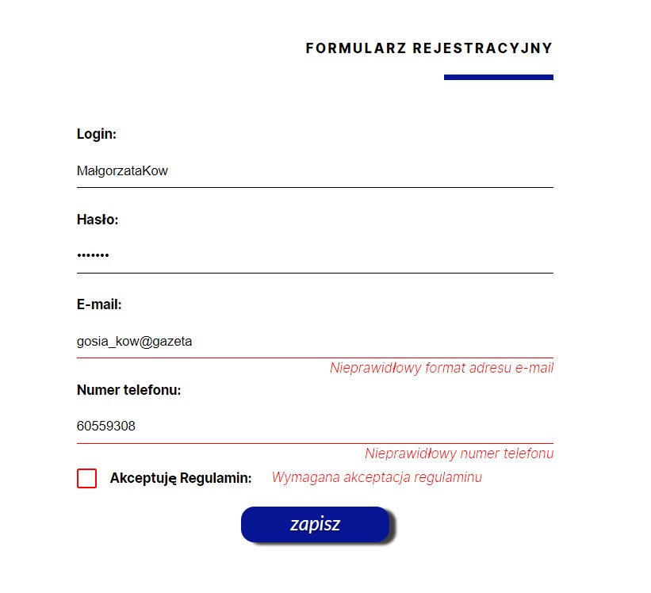

# SWAPI

&nbsp;

## Table of contents

[⭐ Overview](#⭐-overview)

- [The challenge](#the-challenge)
- [Instalation](#Installation-💿)
- [Links](#links)

[💡 My process](#💡-my-process)

- [Technologies](#Technologies)
- [Solutions provided in the project](#Solutions-provided-in-the-project)
- [Useful resources](#useful-resources)

[Screenshot](#screenshot)

[🙋‍♂️ Author](#🙋‍♂️-author)


&nbsp;

## ⭐ Overview

&nbsp;

### **The challenge:**

The App is a part of recruitment process to Junior Front-End Developer of [Spektrum IT](www.spektrumit.pl) 

The App:

- consists of two part on which you can move comfortably.
- The first one is created to display profile data from API concernig star wars stars.
- The RegistrationForm with a validation thans to the user is informed after entering incorrect data.

&nbsp;

### **Installation 💿**

The project uses [node](https://nodejs.org/en/), [npm](https://www.npmjs.com/), and [CRA](https://create-react-app.dev/).

Having them installed, type into the terminal:

```
npm i
```

Then, you may run webpack typing in the terminal:

```
npm start
```

App is available using the following addresses:

http://localhost:3000

&nbsp;

### **Links:**

- [GitHub](https://github.com/kowackag/swapi)
- [Live](http://kowackag.github.io/swapi)
&nbsp;

## 💡 My process

&nbsp;

### **Technologies:**


&nbsp;

### **Solutions provided in the project:**

- HTML:
  - The project was built using semantic HTML5 markup.
- CSS:
  - The css styles are created using `styled-components`.
  - It was prepared fully responsive app.
  - The `Custom Checkbox` was created.
- TS:
  - ES2015+ (arrow functions, destructuring, spread operator) was used.
  - To store all communication with the API in one place, the function DataAPI was created (in the separated file `DataAPI.js`).
  - Communication with API is based on `axios()`.
  - All fields are validated using `yup` and `RegExr`.
- React:
  - The following hooks were used: `useState`, `useEffect`, `useCallback` and `useContext`.
  - To make easier managing register forms `react-hook-forms` and `useForm()` hook was used.
  - In case of extending the app to simplify this process, the components are split and kept as simple as possible that will.

I had opted to use `styled-components` as a solution for managing the CSS.

To make coding with `styled-component` more comfortable, I used a special Extension in Visual Studio Code `vscode-styled-components`.

I used the `createGlobalStyle` function from styled-components and added reset style and some global styles (`Reset.js` and `Global.js`)

```
import {createGlobalStyle} from 'styled-components';

const GlobalStyle = createGlobalStyle`
    @font-face {
        font-family: "Lato";
        font-style: normal;
        font-weight: 400;
        src:
        url(${LatoRegularWoff2}) format('woff2'),
        url(${LatoRegularWoff}) format('woff');
    }
    // ...
```

Hook `useContext` was used to provide access to data by both `RegisterForm` and `StarWars components` the form with user inputs. The folowing context was created:

```
interface ProfileData {
  name: string;
  created: string;
  vehicles: string[] | [];
}

type ProfileContextType = {
  avatarProfileList: ProfileData[] | [];
  setAvatarProfileList: React.Dispatch<
    React.SetStateAction<ProfileData[] | []>
  >;
};

const iProfileContextState = {
  avatarProfileList: [],
  setAvatarProfileList: () => {},
};

const ProfileListContext =
  React.createContext<ProfileContextType>(iProfileContextState);

export { ProfileListContext };

```
Hook `useForm` was used to manage register forms.

```
import { FieldValues, useForm } from 'react-hook-form';
  ..... 
  const {
      register,
      handleSubmit,
      reset,
      formState: { errors },
    } = useForm<FieldValues>({
      resolver: yupResolver(valdationSchema),
      mode: 'all',
    });

```

### **Useful resources:**

- [swapi](https://swapi.py4e.com/)
- [Google Font](https://fonts.google.com/specimen/Lato) - `Lato`
- [Google Font](https://fonts.google.com/specimen/Inter) - `Inter`
- [Font Squirrel Webfont generator](https://www.fontsquirrel.com/tools/webfont-generator)

&nbsp;

## **Screenshot:**

&nbsp;



The RegisterForm incorrectly filled out 


## 🙋‍♂️ Author

The project was made by Małgorzata Kowacka.

- kowackag@gmail.com
- GitHub - [kowackag](https://github.com/kowackag)
- Linked - [Małgorzata Kowacka](https://www.linkedin.com/in/ma%C5%82gorzata-kowacka-0258a812a/)

  **If you have any questions do not hesitate to contact me.**

&nbsp;
